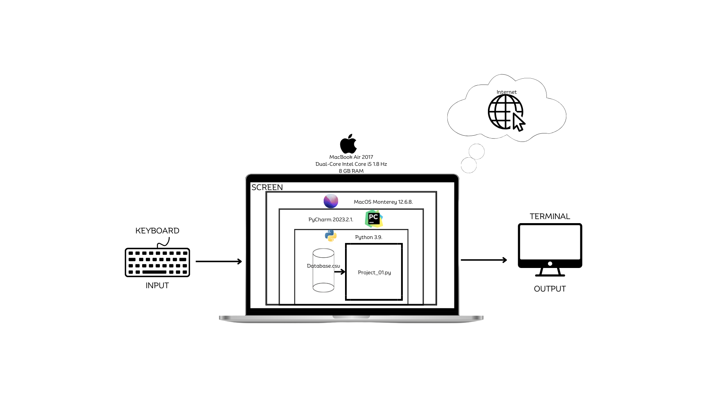

# Crypto Wallet


**Fig.1:** Crypto GIF Made by Mr. Cryply
# Criteria A: Planning
## Problem Definition

Ms. Sato is a local trader who is interested in the emerging market of cryptocurrencies. She has started to buy and sell electronic currencies, however at the moment she is tracking all his transaction using a ledger in a spreadsheet which is starting to become burdensome and too disorganized. It is also difficult for Ms. Sato to find past transactions or important statistics about the currency. Ms Sato is in need of a digital ledger that helps her track the amount of the cryptocurrency, the transactions, along with useful statistics.

## Proposed Solution

### Design Statement

I will to design and make a Python Code for a client who is really interested in Cryptocurrencies. The Cryptocurrency that I am going to use is Cardano (ADA), this Python Code is constructed using the software of a MacBook Air 2017. It will take approximately two weeks and it is going to be evaluated with the criteria that is sitted below.

### Description of the Currency

I will use the Crypto Coin named Cardano (ADA). Cardano is a blockchain platform for changemakers, innovators, and visionaries, with the tools and technologies required to create possibility for the many, as well as the few, and bring about positive global change. Was created to provide a more secure and scalable platform for the development of smart contracts and decentralized applications (DApps). It was founded by Charles Hoskinson, one of the co-founders of Ethereum, and developed by the company IOHK (Input Output Hong Kong).

### Description of my Software
My software is named Cardinity, where the function of this software is to have a record of transactions that the costumer have with the Crypto Coin of Cardano. This have different options that the costumer can do.
The first thing that you can do is have your procedures in a Safe Place, because you need to log-in by a username and a password that only the costumer know. In the case that the costumer forget the password, after three attempts, the costumer can recover the password
by following the steps that are showed on the software.

### Justification
For this Software I will be using Python 3.9. on PyCharm 23.2.1. running this on a MacBook Air model 2017. I will be using Phyton because the costumer wants a software that can be run on an effective way. Definitely Python can be used in a good way
it will develop the software without problems and can help with everything. PyCharm give the costumer a better experience, making our life easier to understand the different things that the project have. This software can be run without problems on Windows, Linux and different operative systems.
The costumer just need to have PyCharm to run the software.

## Success Criteria
1. The electronic ledger is a text-based software (Runs in the Terminal).
2. The electronic ledger display the basic description of the cryptocurrency selected.
3. The electronic ledger allows to enter, withdraw and record transactions.
4. The electronic ledger gives the opportunity to save every buy and sale made with the currency and print it as a pdf.
5. The electronic ledger allows an option to enter a date and watch the transactions that the costumer made on that day.
6. The electronic ledger shows the graphs about the Crypto Coin.
7. The electronic ledger have a login system that gives the opportunity to restore the password by some questions.

# Criteria B: Design

## System Diagram

**Fig.2:** System Diagram Image

## Flow Diagrams

## Record of tasks
| Task No | Planned Action          | Planned Outcome                                                                                                                                                                                          | Time estimate     | Target completion date | Criteria |
|---------|-------------------------|----------------------------------------------------------------------------------------------------------------------------------------------------------------------------------------------------------|-------------------|------------------------|----------|
| 1       | Create a system diagram | To have a clear idea of the hardware and software requirements for the process                                                                                                                           | 10 min            | Sep 13                 | B        |
| 2       | Create a login system   | To have a flow diagram and the code for the login system                                                                                                                                                 | 30 min            | Sep 14                 | B, C     |
| 3       | Create a sign in system | To have a program that keeps the information safe and no one can access it, except the costumer. In the case that the costumer forgets the password, the costumer will have he opportunity to recover it | 1 hour and 30 min | Sep 20                 | B, C     |
|         |                         |                                                                                                                                                                                                          |                   |                        |          |
|         |                         |                                                                                                                                                                                                          |                   |                        |          |
|         |                         |                                                                                                                                                                                                          |                   |                        |          |
|         |                         |                                                                                                                                                                                                          |                   |                        |          |
|         |                         |                                                                                                                                                                                                          |                   |                        |          |
|         |                         |                                                                                                                                                                                                          |                   |                        |          |

# Criteria C: Development

## Login System
```.py
def try_login(name:str, password:str) -> bool:
    with open('09.14_Users.csv',mode='r') as f:
        data = f.readlines()

    success = False
    for line in data:
        uname = line.split(',')[0]
        upass = line.split(',')[1].strip()
        if uname == name and upass == password:
            success = True
            break
    return success

attempts = 3
in_name = input("Enter your username")
in_pass = input("Enter your password")
result = try_login(name=in_name, password=in_pass)
while result == False and attempts > 1:
    in_name = input("Enter your username")
    in_pass = input("Enter your password")
    result = try_login(name=in_name,password=in_pass)
    attempts -= 1

if result == False:
    print("Sayonara")
    exit(1)
```