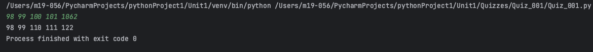
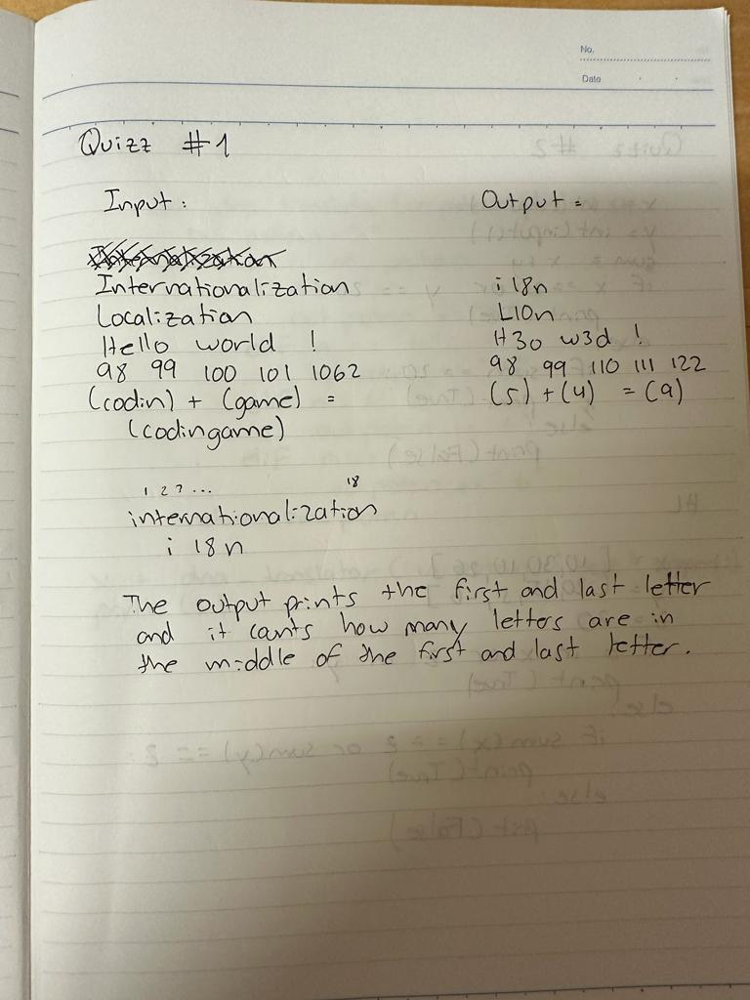

# Quizz 001
## Black Box: Describe a program that  produces the output shown with the input provided.
### Python Code
```.py
word = str(input())
words_split = word.split(" ")
count = 0
while count < len(words_split):
    if len(words_split[count]) > 2:
        print(f"{words_split[count][0]}{len(words_split[count])-2}{words_split[count][-1]}", end=" ")
        count = count + 1
    else:
        print(words_split[count], end=" ")
        count = count + 1
```
### Proof

**Fig 1.** Proof of the Quiz 001
### Flow Chart

### Work on paper

**Fig**