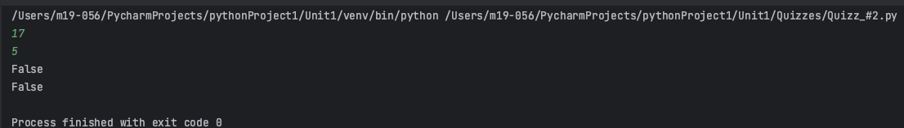
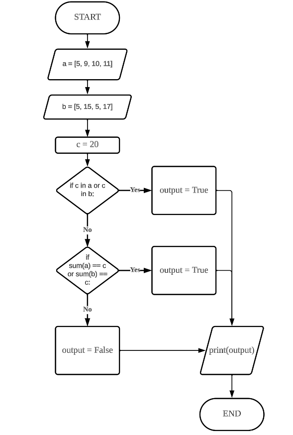
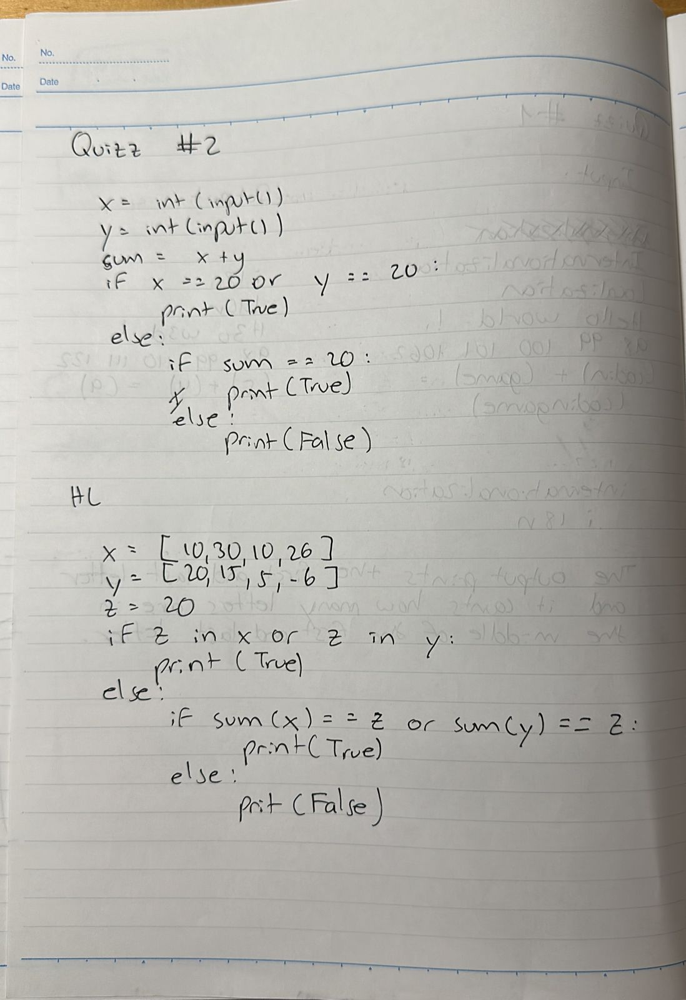

# Quiz 002
## Given 2 numbers, A and B, Output TRUE if one of them is 20 or if their sum is 20.
### Python Code
```.py
# Given 2 numbers, A and B, Output TRUE if one of them is 20 or if their sum is 20.
x = int(input())
y = int(input())
add = x + y
if x == 20 or y == 20:
    print(True)
else:
    if add == 20:
        print(True)
    else:
        print(False)

# HL Part
a = [5, 9, 10, 11]
b = [5, 15, 5, -6]
c = 20
if c in a or c in b:
    print(True)
else:
    if sum(a) == c or sum(b) == c:
        print(True)
    else:
        print(False)
```
### Proof

**Fig.1:** Proof of the Quiz 002

### Flow Chart

**Fig.2:** Flow Chart of the Quiz 002

### Work on paper

**Fig.3:** Work on paper of the Quiz 002