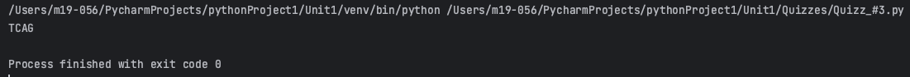
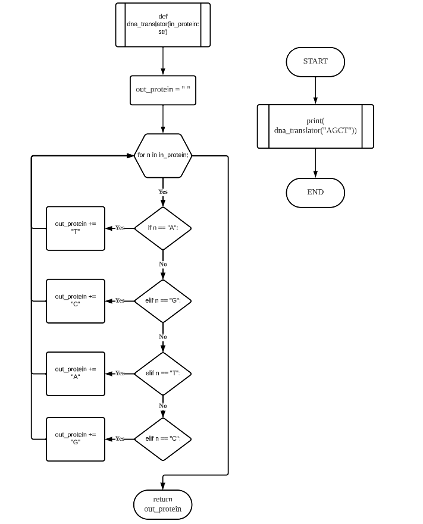
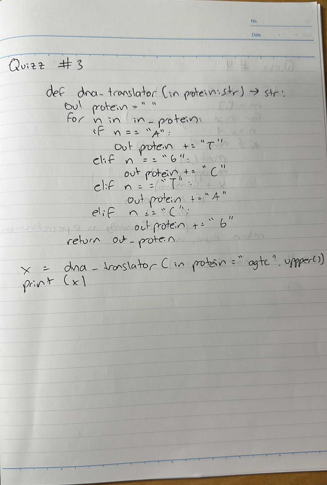

# Quiz 003
## Create a program that translate the proteins in the DNA chain as shown below
### Python Code
```.py
def dna_translator(in_protein: str) -> str:
    out_protein = ""
    for n in in_protein:
        if n == "A":
            out_protein += "T"
        elif n == "G":
            out_protein += "C"
        elif n == "T":
            out_protein += "A"
        elif n == "C":
            out_protein += "G"
    return out_protein


x = dna_translator(in_protein="agtc".upper())
print(x)
```
### Proof

**Fig.1:** Proof of the Quiz 003

### Flow Chart

**Fig.2:** Flow Chart of the Quiz 003

### Work on paper

**Fig.3:** Work on paper of the Quiz 003