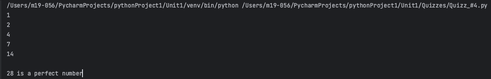
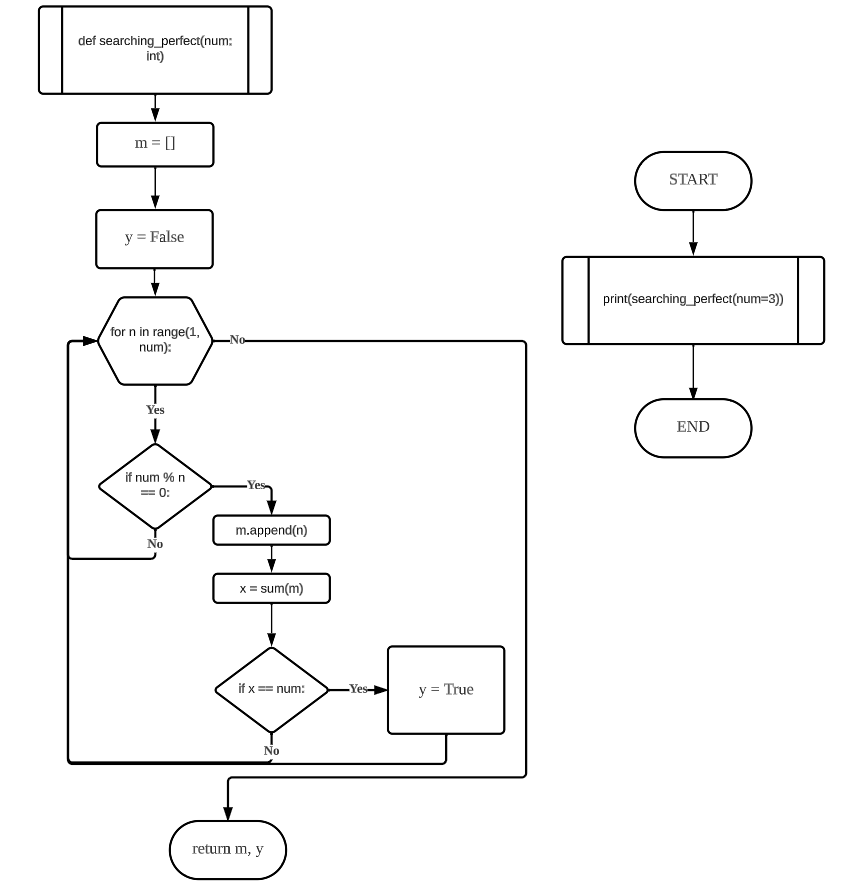
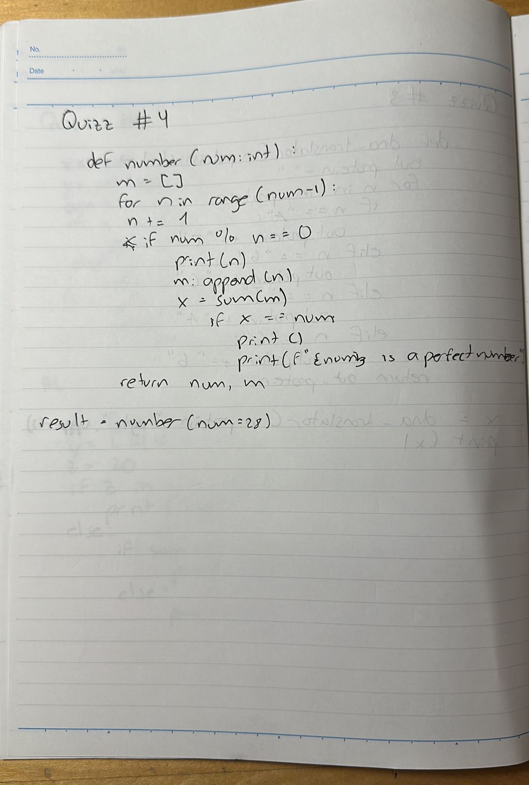

# Quiz 004
## Given a number, create a program that produces the output factors.
### Python Code
```.py
def number(num: int):
    m = []
    for n in range(num - 1):
        n += 1
        if num % n == 0:
            print(n)
            m.append(n)
            x = sum(m)
            if x == num:
                print()
                print(f"{num} is a perfect number")
    return num, m


result = number(num=28)
```
### Proof


### Flow Chart


### Work on paper
