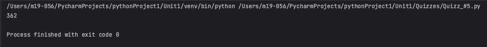

# Quiz 005
## Given a string, create a program that produces the sum of the characters in the string.
### Python Code
```.py
def sum(text:str) -> int:
    ttl = 0
    for let in text:
        ttl += int(ord(let))
    return ttl

x = sum(text="MAth")
print(x)
```

### Proof

**Fig.1:** Proof of the Quiz 005

### Flow Chart

**Fig.2:** Flow Chart of the Quiz 005

### Work on paper

**Fig.3:** Work on paper of the Quiz 005