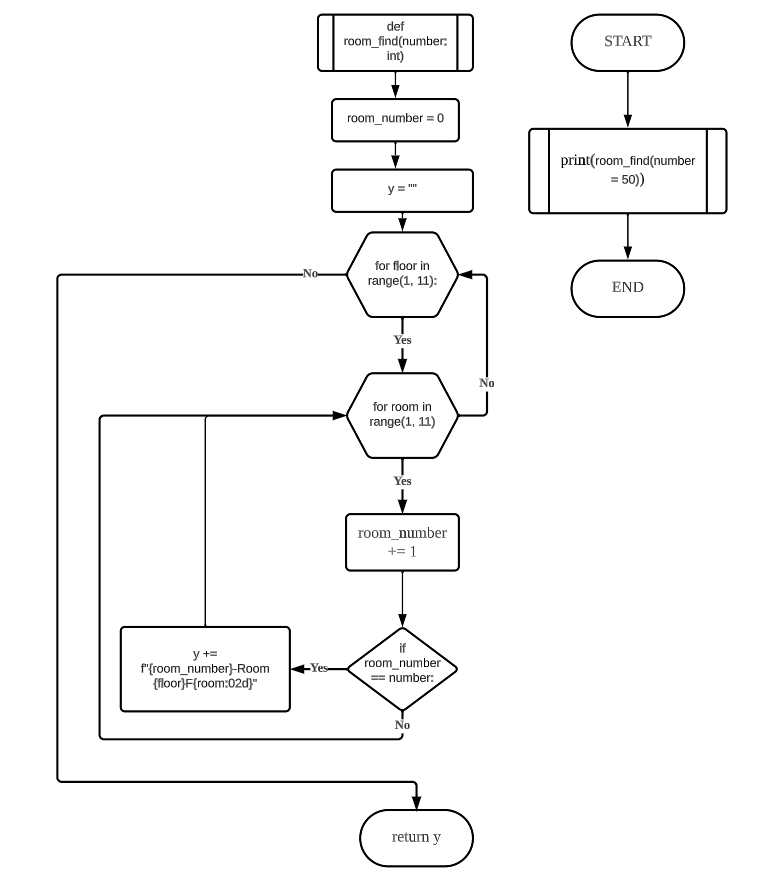

# Quiz 006
## A hotel has 10 floors and 10 rooms on each floor. Write a program that prints the names of all rooms in the following format
### Python Code
```.py
def room_find(number: int) -> int:
    room_number = 0
    for floor in range(1, 11):
        for room in range(1, 11):
            room_number += 1
            if room_number == number:
                print(f"{room_number}-Room {floor}F{room:02d}")
    return room_number

find_room = room_find(number = 50)
```

### Proof


### Flow Chart


### Work on paper
