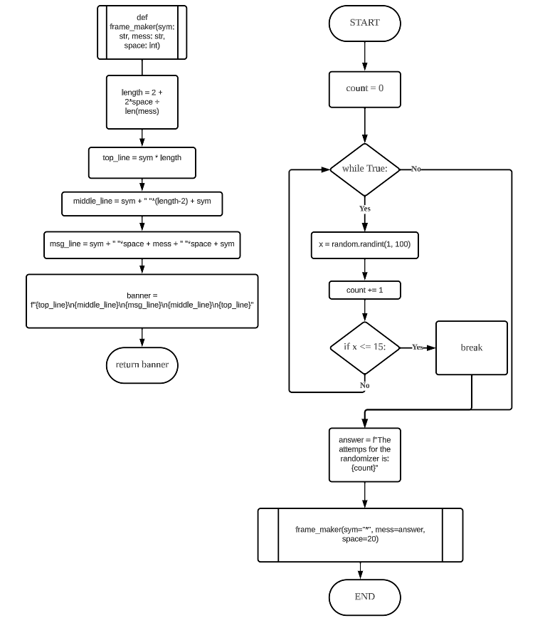

# Quizz 007
## Write a program that counts the number of times it takes for a random number in the range 1 to 100 to be less than or equal to 15. Print a nice message
### Phyton Code
```.py
import random

count = 0
while True:
    x = random.randint(1, 100)
    count += 1
    if x <= 15:
        break
def frame_maker(sym: str, mess: str, space: int) -> str:
    length = 2 + 2*space + len(mess)

    top_line = sym * length
    middle_line = sym + " "*(length-2) + sym
    msg_line = sym + " "*space + mess + " "*space + sym

    banner = f"{top_line}\n{middle_line}\n{msg_line}\n{middle_line}\n{top_line}"
    return banner

answer = f"The attemps for the randomizer is: {count}"
cover_answer = frame_maker(sym="*", mess=answer, space=20)
print(cover_answer)
```
### Proof


### Flow Chart


### Work on paper
