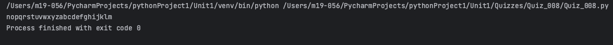
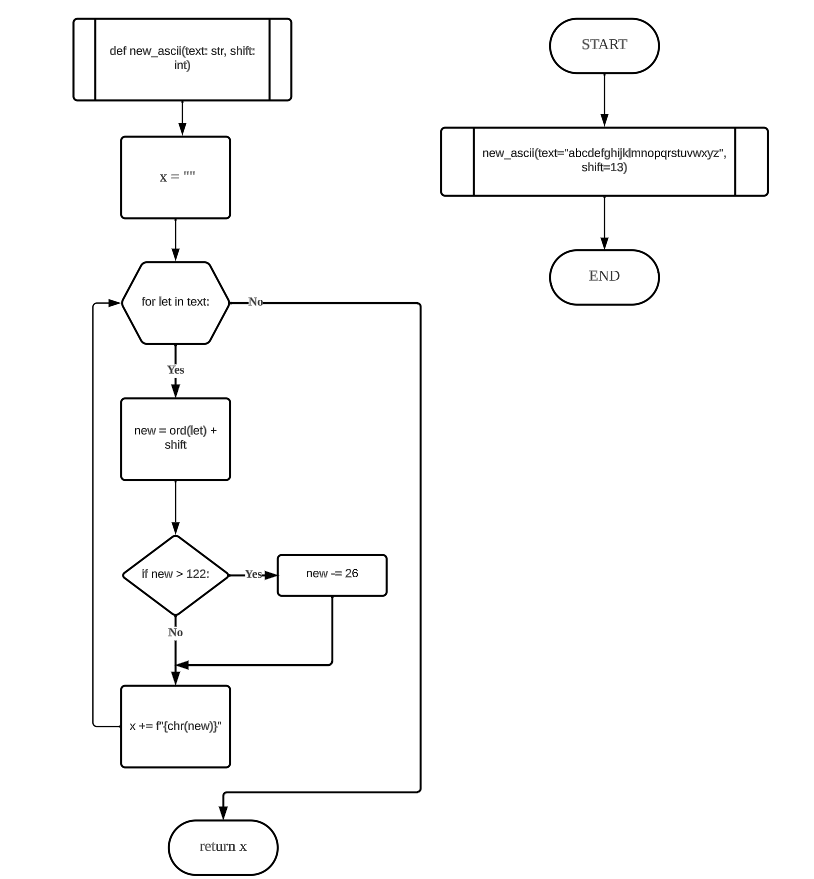
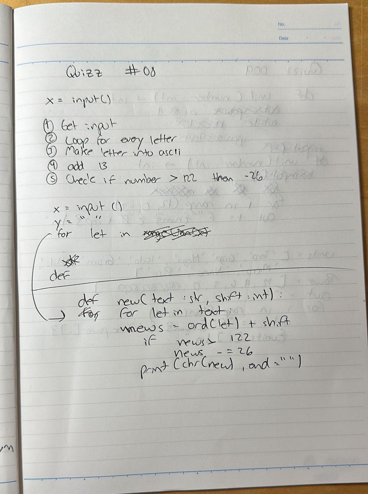

# Quiz 008
## Create a function that receives as input a string and returns the string ciphered with shift 13
### Python Code
```.pyc
def new_ascii(text: str, shift: int):
    for let in text:
        new = ord(let) + shift
        if let == " ":
            print(" ", end="")
            continue
        elif new > 122:
            new -= 26
        print(chr(new), end="")


x = new_ascii(text="abcdefghijklmnopqrstuvwxyz", shift=13)
```

### Proof


### Flow Chart


### Work on paper
