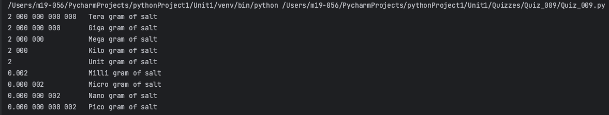
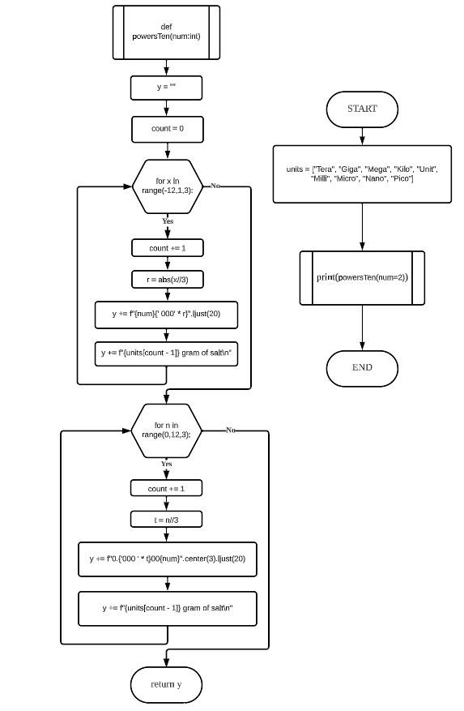
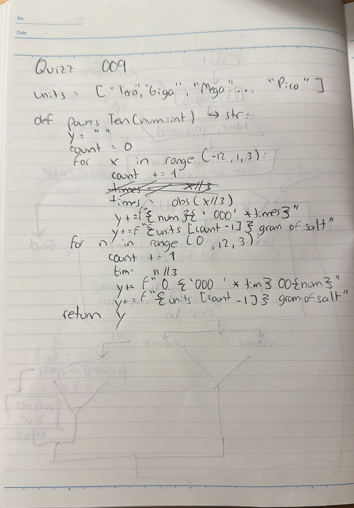

# Quiz 009
## Create a function that produces the powers of ten from pico (10^-12), to tera (10^15) for a number provided as an input.
### Python Code
```.py
units = ["Tera", "Giga", "Mega", "Kilo", "Unit", "Milli", "Micro", "Nano", "Pico"]
def powersTen(num:int) -> str:
    y = ""
    count = 0
    for x in range(-12,1,3):
        count += 1
        r = abs(x//3)
        y += f"{num}{' 000' * r}".ljust(20)
        y += f"{units[count - 1]} gram of salt\n"
    for n in range(0,12,3):
        count += 1
        t = n//3
        y += f"0.{'000 ' * t}00{num}".center(3).ljust(20)
        y += f"{units[count - 1]} gram of salt\n"
    return y
x = powersTen(num=2)
print(x)
```
### Proof

**Fig.1:** Proof of the Quiz 009
### Flow Chart

**Fig.2:** Flow Chart of the Quiz 009
### Work on paper

**Fig.3:** Work on paper of the Quiz 009
