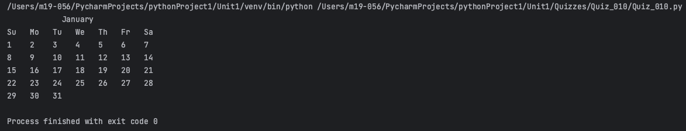
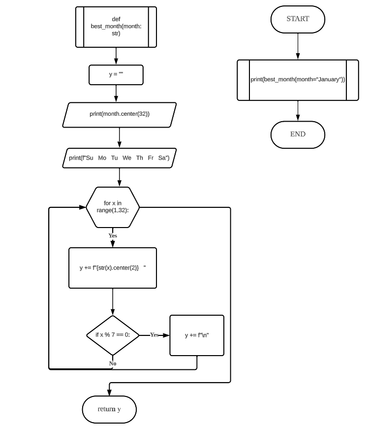
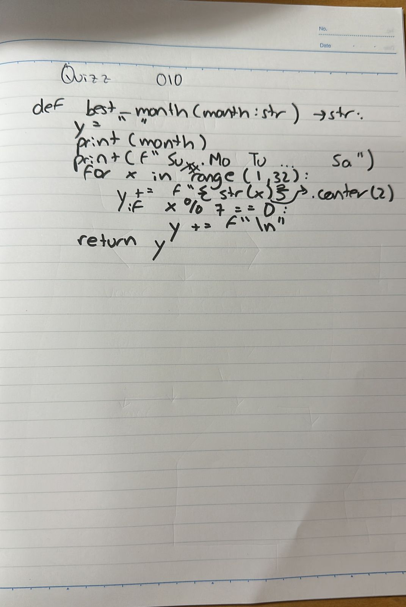

# Quiz 010
## Create a function that shows the days of your birthday’s month for the year 2023.
### Python Code
```.py
def best_month(month: str) -> str:
    y = ""
    print(month.center(32))
    print(f"Su   Mo   Tu   We   Th   Fr   Sa")
    for x in range(1,32):
        y += f"{str(x).center(2)}   "
        if x % 7 == 0:
            y += f"\n"
    return y

out = best_month(month="January")
print(out)
```
### Proof

**Fig.1:** Proof of the Quiz 010
### Flow Chart

**Fig.2:** Flow Chart of the Quiz 010
### Work on paper

**Fig.3:** Work on paper of the Quiz 010