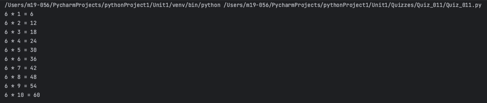
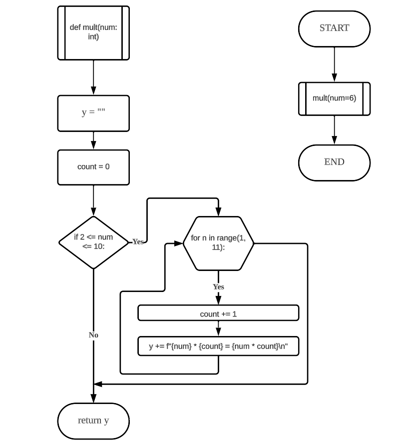
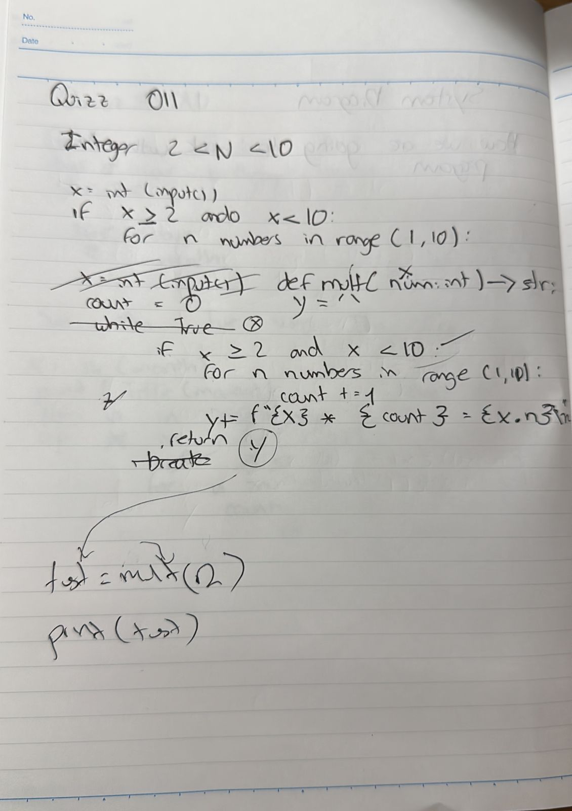

# Quiz 011
## Create a function that receives integer 2<N<10, and returns the multiplication table for the number up to 9.
### Python Code
```.py
def mult(num: int) -> str:
    y = ""
    count = 0
    if 2 <= num <= 10:
        for n in range(1, 11):
            count += 1
            y += f"{num} * {count} = {num * count}\n"
        return y


result = mult(num=6)
print(result)
```
### Proof


**Fig.1:** Proof of the Quiz 011

### Flow Chart


**Fig.2:** Flow Chart of the Quiz 011

### Work on paper


**Fig.3:** Work on paper of the Quiz 011