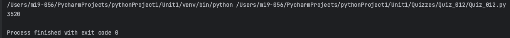
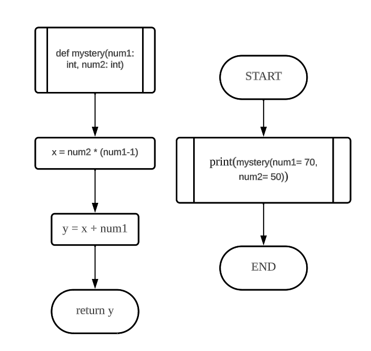
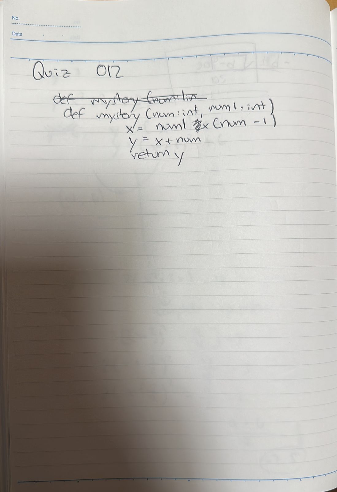

# Quiz 012
## Create a function that receives one input and produces the output shown.
### Python Code

```.py
def mystery(num1: int, num2: int) -> int:
    x = num2 * (num1-1)
    y = x + num1
    return y

out = mystery(num1= 70, num2= 50)
print(out)
```

### Proof


**Fig.1:** Proof of the Quiz 012

### Flow Chart


**Fig.2:** Flow chart of the Quiz 012

### Work on paper


**Fif.3:** Work on paper of the Quiz 012