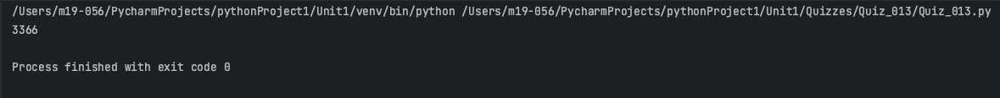
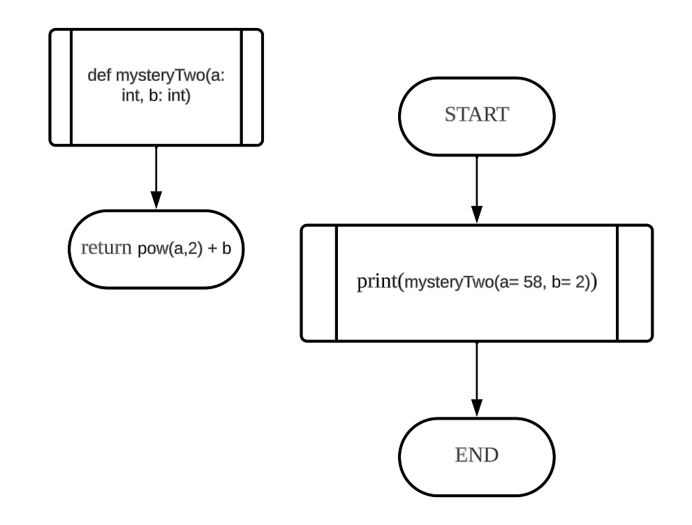
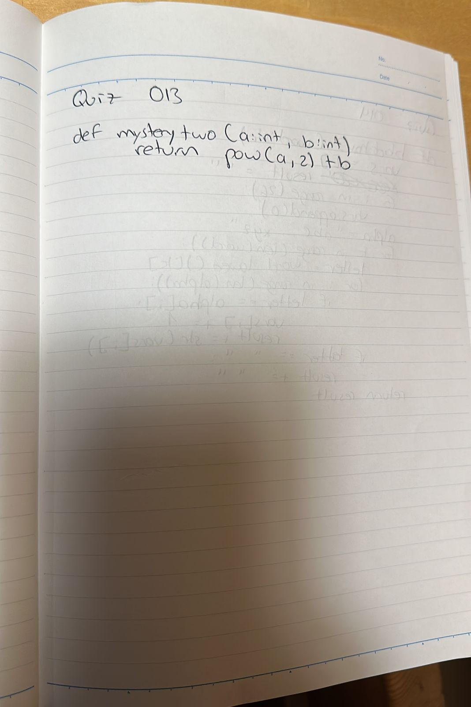

# Quiz 013
## Create a function that produces the output given the input shown
### Python Code
```.py
def mysteryTwo(a: int, b:int) -> int:
    return pow(a,2) + b

out = mysteryTwo(a=58, b=2)
print(out)
```

### Proof


**Fig.1:** Proof of the Quiz 013

### Flow Chart


**Fig.2:** Flow Chart of the Quiz 013

### Work on paper


**Fig.3:** Work on paper of the Quiz 013