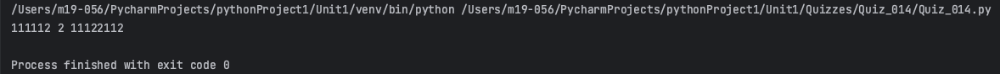
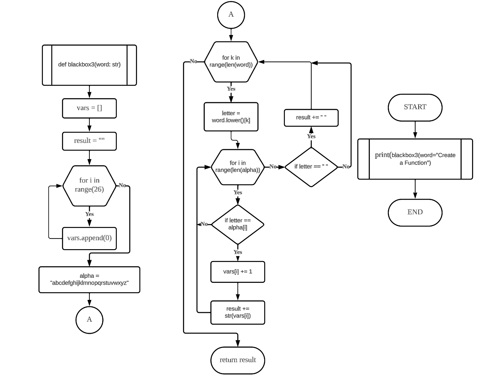
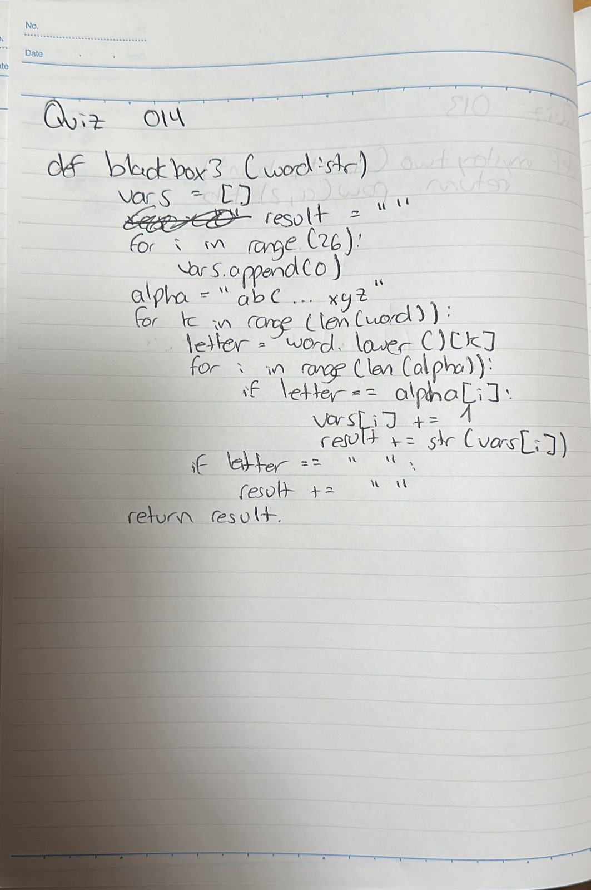

# Quiz 014
## Create a function that produces the output given the input shown
### Python Code
```.py
def blackbox3(word: str) -> str:
    vars = []
    result = ""
    for i in range(26):
        vars.append(0)
    alpha = "abcdefghijklmnopqrstuvwxyz"
    for k in range(len(word)):
        letter = word.lower()[k]
        for i in range(len(alpha)):
            if letter == alpha[i]:
                vars[i] += 1
                result += str(vars[i])
        if letter == " ":
            result += " "
    return result


out = blackbox3(word="Create a Function")
print(out)
```

### Proof


**Fig.1:** Proof of the Quiz 014

### Flow Chart


**Fig.2:** Flow Chart of the Quiz 014

### Work on paper


**Fig.3:** Work on paper of the Quiz 014