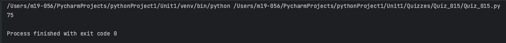
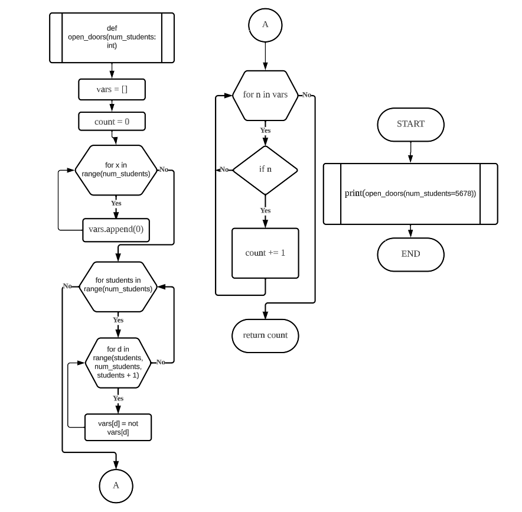
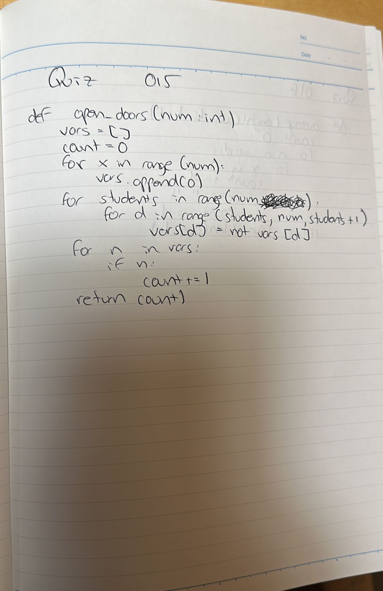

# Quiz 015
## There are N closed doors in a school and N students present. The first student opens each door. The second student flips (open⇆close) every second door. The third student flips every third door, and so on.
### Python Code
```.py
def open_doors(num_students: int) -> int:
    vars = []
    count = 0
    for x in range(num_students):
        vars.append(0)
    for students in range(num_students):
        for d in range(students, num_students, students + 1):
            vars[d] = not vars[d]
    for n in vars:
        if n:
            count += 1
    return count

z = open_doors(num_students=5678)
print(z)
```

### Proof


**Fig.1:** Proof of the Quiz 015

### Flow Chart


**Fig.2:** Flow Chart of the Quiz 015

### Work on paper


**Fig.3:** Work on paper of the Quiz 015