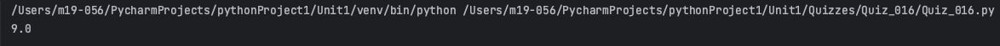

# Quiz 016
## Create a function that produces the average world length of the input list
### Python Code
```.py
def avaregeLength(words:list) -> float:
    count = 0
    for n in words:
        for x in n:
            count += 1
            if x == " ":
                count -= 1
    return count/len(words)


z = avaregeLength(words=["Computer Science", "Art"])
print(z)
```

### Proof


**Fig.1:** Proof of the Quiz 016

### Flow Chart


**Fig.2:** Flow Chart of the Quiz 016

### Work on paper


**Fig.3:** Work on paper of the Quiz 016